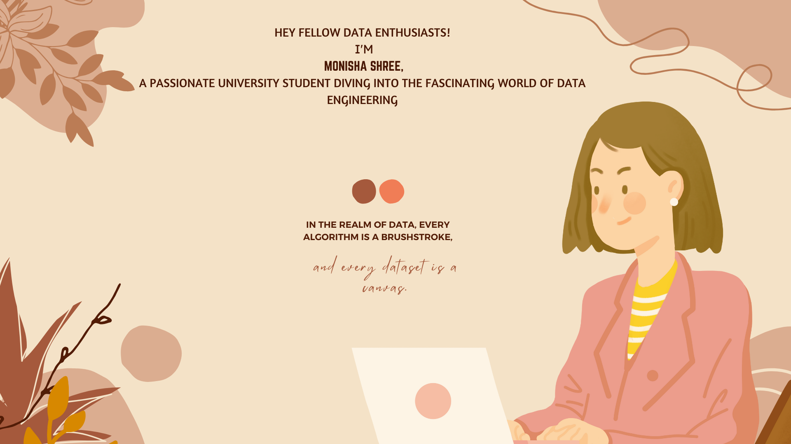

#🚀**Data Engineer**

 
 

## 🎓 **Current Academic Arsenal**

- **Major**: Computer Science
- **Courses**: Big Data, Algorithms, Data Structures
- **Self-Study**: Data Engineering Concepts, ETL Processes

## 🛠️ **Tools I'm Crafting With**

- **Languages**: Python, SQL
- **Frameworks**: PySpark, Pandas
- **Visualization**: Matplotlib, Seaborn, PowerBI
- **Databases**: SQLDeveloper
- **Big Data**: Azure Data Lake Storage, Azure Data Factory, Azure Databricks, Azure Synapse 

## 🤝 **Let's Connect and Learn Together**

-[ Monisha Shree](https://www.linkedin.com/in/monisha-shree-6b8663156/)
&nbsp;
